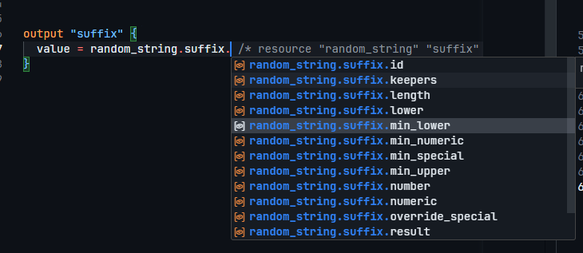

# REQUIRED PROVIDERS

## Definir required providers

En un archivo llamado ```version.tf```

```sh
terraform {
  required_providers {
    random = {
      source  = "hashicorp/random"
      version = ">= 3.8.1"
    }
  }
}
```
Como es un archivo en el que normalmente se hace mucho copiar/pegar revisar cosas como que el nombre del proveedor sea el mismo tanto en 'random =', como en 'source = 'hashicorp/random'

Lanzo ```$ terraform init```

```sh

Terraform has been successfully initialized!

You may now begin working with Terraform. Try running "terraform plan" to see
any changes that are required for your infrastructure. All Terraform commands
should now work.

If you ever set or change modules or backend configuration for Terraform,
rerun this command to reinitialize your working directory. If you forget, other
commands will detect it and remind you to do so if necessary.
```

## Referencing Resource Outputs

Puedo crear una output variable que guarde atributos de un resource que haya creado.

Si en el main.tf he creado esto:

```sh
resource "random_string" "suffix" {
  length  = 6
  upper   = false
  special = false
}
```

En el fichero output puedo declarar una variable que me permite guardar el valor del resource "random_string" con el nombre "suffix".

```sh
output "suffix" {
  value = random_string.suffix.result /* resource "random_string" "suffix" */
}
```

En este caso, guardo la propiedad result del resource 'random_string' que yo he llamado 'suffix', tal y como se ve en el fichero main.tf

Salida:

```sh
app_name = "blog"
env_name = "prod"
env_prefix = "blog-prod"
suffix = "od54hq"
```

Gracias a las extensiones de vscode, puedo ver las diferentes propieades de un recurso:



# Default input variables

Creando un archivo .tfvars, puedo declarar ahí la input variables
```sh
app_name = "blog"
env_name = "dev"
```
Y al hacer ```terraform apply``` ya las reconoce. El archivo ```vars.tf``` lo debo conservar igualmente:

```sh
variable "app_name" {
}

variable "env_name" {
}

```

## Input variables for env config

