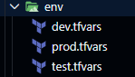

# Config env

Como configurar diferentes entornos (desarrollo, producción..)

Crear un archivo llamado ```dev.tfvars``` y paso ahí la variable ```env_name = "dev"``` del fichero ```terraform.auto.tfvars.```.

Si lanzo ```$ terraform apply```, me saldrá un prompt pidiendo el valor de ```env_name```. Eso es porque Terraform busca por defecto en el fichero acabado en ```auto.ftvars```. Para especificar uno en concreto, utilizar ```$ terraform apply -var-file dev.tfvars```. Ojo, también busca en los ```auto.ftvars```. No es excluyente.

He cambiado el valor de 'dev' a 'prod' en el fichero ```dev.tfvars``` y Terraform lo detecta:

```sh
   Do you want to perform these actions?
  Terraform will perform the actions described above.
  Only 'yes' will be accepted to approve.

  Enter a value: yes


Apply complete! Resources: 0 added, 0 changed, 0 destroyed.

Outputs:

app_name = "blog"
env_name = "prod"
env_prefix = "blog-prod-od54hq"
suffix = "od54hq"
```

## Managing input vars file for multiple env

Una buena práctica es crear un directorio llamado env y dentro colocar un archivo por cada entorno (prod, test, dev):




