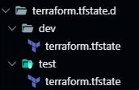

# WORKSPACES

Terraform utiliza por defecto un workspace 'default'

Listar workspaces:

```sh
$ terraform workspace list
* default
```
Crear un workspace nuevo 'dev'. Al hacer esto, crea un nuevo estado de la configuración. Esto permite cambiar entre diferentes workspaces (dev, prod...)

```sh
$ terraform workspace new dev
  default
* dev
```

Para el workspace dev utilizo el 'dev.tfvars', en vez del 'prod.tfvars', que pertenecería al default workspace:

```sh
$ terraform apply -var-file ./env/dev.tfvars

Plan: 1 to add, 0 to change, 0 to destroy.
Changes to Outputs:
  + api_key                 = (sensitive value)
  + app_name                = "blog"
  + env_name                = "dev"
  + env_prefix              = (known after apply)
  + kind                    = "P"
  + primary_region          = "westeu"
  + primary_region_instance = "8"
  + suffix                  = (known after apply)
```

Para seleccionar un workspace (default en este caso)

```sh
$ terraform workspace select default
Switched to workspace "default"
```
Si aquí ejecuto ```$ terraform apply -var-file ./env/dev.tfvars``` nuevamente pero en el workspace default, Terraform avisa de que va a realizar los siguientes cambios:

```sh
Changes to Outputs:
  ~ env_name                = "prod" -> "dev"
  ~ env_prefix              = "blog-prod-od54hq" -> "blog-dev-od54hq"
```
Por eso hay que estar seguro de qué ejecutamos dependiendo el entorno (workspace)

Se crea un directorio llamado 'terraform.tfstate.d' dónde se guarda la configuración de los diferentes workspaces. El default se guarda en la raiz del proyecto.


