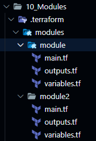

# Modules

Hashicorp tiene un módulo de pruebas: 

Añado un par de módulos del mismo source en ```main.tf```. Cuando se añade un módulo se debe reiniciar la aplicación ```terraform init```

```sh
module "module" {
  source  = "hashicorp/module/random"
  version = "1.0.0"
}

module "module2" {
  source  = "hashicorp/module/random"
  version = "1.0.0"
}


```sh
Downloading registry.terraform.io/hashicorp/module/random 1.0.0 for module...
- module in .terraform/modules/module
Downloading registry.terraform.io/hashicorp/module/random 1.0.0 for module2...
- module2 in .terraform/modules/module2
```




Extraigo los módulos en el fichero output.tf:

```sh

output "module1" {
  value = module.module.random_string
}

output "module2" {
  value = module.module2.random_string
}

```

Y al ejecutar ```$ terraform apply -var-file ./dev/prod.tfvars```:

```sh
Plan: 2 to add, 0 to change, 0 to destroy.

Changes to Outputs:
  + module1                 = (known after apply)
  + module2                 = (known after apply)

```
Yes:

```sh
module1 = "Application config output: Un7$XIYt"
module2 = "Application config output: gxNub0Ag"
```


